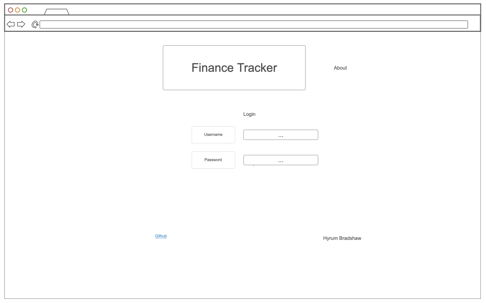
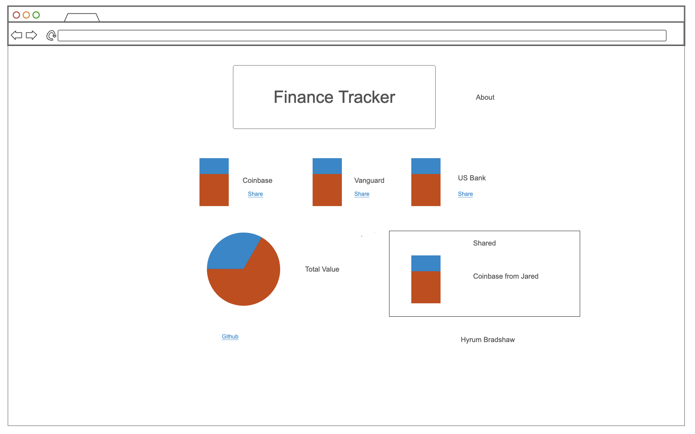
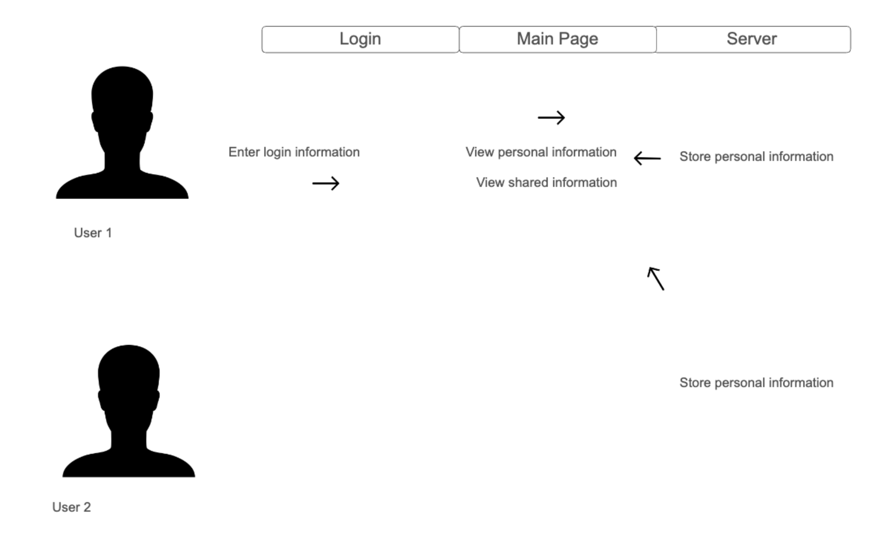

# Finance Tracker

This is a simple application that allows users to create an account, input their investments, and check the live value of each part of their portfolio. It provides tools to update as well based on interest earned and salary earned.

## 🚀 Specification Deliverable

### Elevator pitch

Everyone in the world wants to use their money better, to better understand how their investments are performing and how their money is being used. There are countless separate sources where people invest or choose to store their money, but that's where this simple finance tracker comes in. It serves as a simple home base for people to track their money across all sources, analyze how it's growing, and receive an overall financial report on a weekly, monthly, and yearly basis. The tool is simple but powerful because of it's broad scope--it provides a bird's eye view of your personal finances. It also provides the ability to share an individual investment with another individual, which allows you to compare investment strategy with friends and family.

### Design

One page provides login information, while the next page provides information about each amount of money you have invested in different sources, each with an optional button to share with other users. Underneath there is a totals section that provides information about the total amount of money invested, while there is also a shared values section in the lower-right hand side of the second page.

### Key features

- Secure personal login
- Ability to select investment options
- Ability to input investment amount
- Shared investments displayed in realtime
- Investment value updated via web-sourced values
- Total investment values provided
- Value consistently stored in server

### Technologies

I am going to use the required technologies in the following ways.

- **HTML** - Provides skeleton-like structure of first page, login page. Also provides structure and content for second page with information on investments and hyperlink at the bottom for Github.
- **CSS** - Aesthetic design that can appear on many devices. Most importantly easily visible investment totals and well selected colors for contrast/simple design.
- **React** - Uses React for simple login and routing of shared investment totals between accounts.
- **Service** - Backend service saves login information and shared information, with third-party access for investment information (i.e. stock or coin value).
- **DB/Login** - Secure credentials stored, can't access financial information without credentials.
- **WebSocket** - Broadcasts shared information inputs to other users.

## 🚀 AWS deliverable

For this deliverable I did the following. I checked the box `[x]` and added a description for things I completed.

- [x] **Server deployed and accessible with custom domain name** - [My server link](https://mydinero.click).

## 🚀 HTML deliverable

For this deliverable I did the following. I checked the box `[x]` and added a description for things I completed.

- [x] **HTML pages** - I added four HTML pages, for the home, about, personal investments, and shared investments pages.
- [x] **Proper HTML element usage** - I implemented different types of HTML structures, including sections, lists, and tables.
- [x] **Links** - I connected each part of the HTML files to each other and also linked the GitHub repository.
- [x] **Text** - I included descriptive text to explain and organize my files.
- [x] **3rd party API placeholder** - I included APIs for the current prices of securities.
- [x] **Images** - I uploaded an image for the head of my document that applies to the name of my startup.
- [x] **Login placeholder** - I inserted login placeholders that will connect in the future with the actual database.
- [x] **DB data placeholder** - I input placeholder data for the shared investments page.
- [x] **WebSocket placeholder** - I insert placeholders for the WebSocket HTTP functions that will provide live data in the future.

## 🚀 CSS deliverable

For this deliverable I did the following. I checked the box `[x]` and added a description for things I completed.

- [x] **Header, footer, and main content body** - I designed my own header, created ways to space out and organize the main content of the body, and added a minimalist footer.
- [x] **Navigation elements** - I tried to design the navigation as simply as possible so it would be easily visible.
- [x] **Responsive to window resizing** - I controlled all the sizes of elements so it can apply on mobile or different types of computers.
- [x] **Application elements** - I organized the application so it's easy to understand what information is provided where.
- [x] **Application text content** - I used simple font and added filler content for investment information.
- [x] **Application images** - I added an image on my about page to gift it a bit of flavor and pop.

## 🚀 React part 1: Routing deliverable

For this deliverable I did the following. I checked the box `[x]` and added a description for things I completed.

- [x] **Bundled using Vite** - I bundled the entire thing using Vite and the new React software.
- [x] **Components** - I implemented each of the HTML and CSS components from before into the new React framework.
- [x] **Router** - I routed my software between the previous source and the current hosting source.

## 🚀 React part 2: Reactivity

For this deliverable I did the following. I checked the box `[x]` and added a description for things I completed.

- [X] **All functionality implemented or mocked out** - I saved to local storage all the individual financial information to make the functionality available.
- [X] **Hooks** - All the appropriate JavaScript tools were used to make the connection smooth.

## 🚀 Service deliverable

For this deliverable I did the following. I checked the box `[x]` and added a description for things I completed.

- [X] **Node.js/Express HTTP service** - I created a Node.js server to store all my information.
- [X] **Static middleware for frontend** - I incorporated middleware into my service module and my index.js file.
- [X] **Calls to third party endpoints** - I incorporated a third party endpoint to pull Bitcoin information.
- [X] **Backend service endpoints** - I build backend server endpoints that store a user's financial information.
- [X] **Frontend calls service endpoints** - I included frontend calls that access saved user information and their individual saved financial information.

## 🚀 DB/Login deliverable

For this deliverable I did the following. I checked the box `[x]` and added a description for things I completed.

- [X] **User registration** - I made sure user information is saved so they can only click login if their information is saved to the database.
- [X] **User login and logout** - I incorporated tools to allow users to login and logout based on their MongoDB information
- [X] **Stores data in MongoDB** - I saved all the data in an array on MongoDB.
- [X] **Stores credentials in MongoDB** - All user credentials are properly saved in MongoDB.
- [X] **Restricts functionality based on authentication** - I made sure that only the users that are properly logged in can access all parts of the service.

## 🚀 WebSocket deliverable

For this deliverable I did the following. I checked the box `[x]` and added a description for things I completed.

- [ ] **Backend listens for WebSocket connection** - I did not complete this part of the deliverable.
- [ ] **Frontend makes WebSocket connection** - I did not complete this part of the deliverable.
- [ ] **Data sent over WebSocket connection** - I did not complete this part of the deliverable.
- [ ] **WebSocket data displayed** - I did not complete this part of the deliverable.
- [ ] **Application is fully functional** - I did not complete this part of the deliverable.
